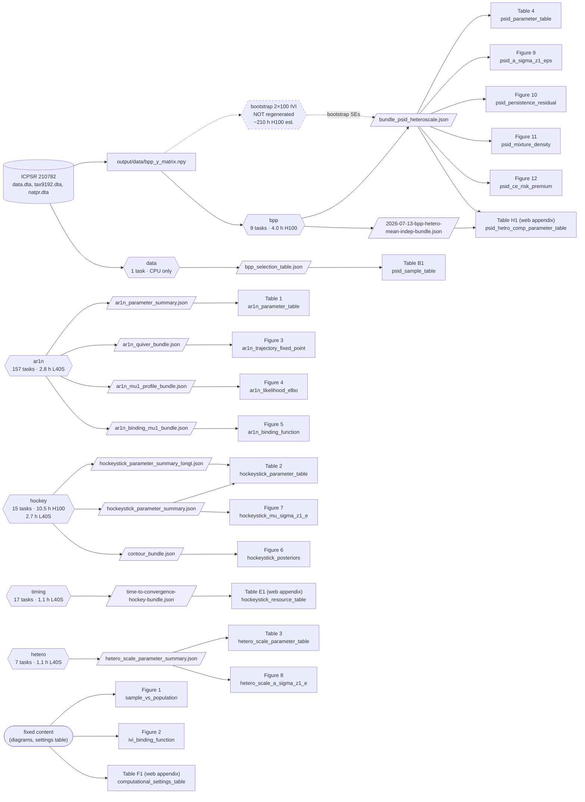

# Replication package: ml-earnings

This package contains the code and published results used to reproduce the
paper's estimates, figures and tables. You can rebuild all figures and tables
from the included results without running the estimations or obtaining the
external data.

This README explains how to get started, how the code is organized, and what
the pipeline produces, including measured run times. The final section covers
data provenance, seeds, execution with scripthut, and other reproducibility
details.

**Table of contents**

1. [How to run the replication](#1-how-to-run-the-replication)
2. [How the code is organized](#2-how-the-code-is-organized)
3. [What the package generates](#3-what-the-package-generates)
4. [Reproducibility and pipeline management](#4-reproducibility-and-pipeline-management)

## 1. How to run the replication

### Set up the requirements

Use Linux x86-64 with git and about 6 GB of free disk space. Install
[mise](https://mise.jdx.dev) to obtain the pinned versions of
[uv](https://docs.astral.sh/uv/) (0.12.0) and
[Tectonic](https://tectonic-typesetting.github.io) (0.17.0). For the journal
EPS files, also install [Ghostscript](https://www.ghostscript.com) ≥ 10
(`gs` on `PATH`, e.g. `sudo apt install ghostscript` on Ubuntu/Debian).
From the repository root, run:

```bash
mise install                # install uv and Tectonic from mise.toml
mise run setup              # install Python 3.12 and pinned packages from uv.lock
mise run test               # consistency checks (~1 min)
```

Without mise, install uv and Tectonic yourself and run `uv sync --frozen`
and `uv run pytest`. Internet access is needed for setup and Tectonic's first
run. No Stata, R, MATLAB or full TeX distribution is needed; see
[environment details](#environment-details) for NixOS setup.

### Rebuild the figures and tables

```bash
uv run python replicate.py run --layer 3 --force    # also available as: mise run figures
```

This uses the included results and writes `output/figures/figures.pdf`,
individual PDFs, LaTeX fragments and journal EPS files. It takes about two
minutes on a laptop and needs neither a GPU nor the external data.

The same build runs on GitHub Actions (`.github/workflows/release.yml`):
pushing a tag `v<version>` matching `version` in `pyproject.toml` attaches
`figures.pdf` to a GitHub release of that name.

### Rerun the estimations

For the empirical results, obtain `data.dta`, `tax9192.dta` and `natpr.dta`
from the Blundell, Pistaferri and Preston (2008) replication package, ICPSR
study 210782. Put them in `ext/bpp/`, or set `BPP_EXT` to their directory.
See [data provenance and checksums](#data-provenance-and-checksums) for details.
Estimation needs an NVIDIA GPU with at least 4 GB of memory, a CUDA 13
compatible driver (≥ 580), and 16 GB of RAM.

```bash
uv run python replicate.py run --layer 1           # build the PSID matrix and sample statistics
uv run python replicate.py run --layer 2           # regenerate the estimation and simulation results
uv run python replicate.py run --layer 3 --force   # rebuild figures and tables from those results
```

The simulation blocks need no external data; for example, run just one with
`uv run python replicate.py run --layer 2 --block hetero`. The default run
uses the included bootstrap results; add `--with-bootstrap` to layer 2 to
regenerate them. See [run times](#run-times) before starting a full run, and
[local execution](#local-execution-and-smoke-tests) or
[cluster execution](#cluster-execution-with-scripthut) for more options.

## 2. How the code is organized

The pipeline has three layers. A *bundle* is a JSON file containing the
estimates or simulation results needed by one or more figures and tables.
Keeping these results separate from the figure generators lets you rebuild
the paper's artifacts from either the published or regenerated estimates.

| Layer | Purpose | Output directory |
|---|---|---|
| 1: data | Build the PSID/BPP earnings matrix and sample statistics from the ICPSR files | `output/data/` |
| 2: bundles | Run estimations and simulations, then collect their results into bundles | `output/bundles/` |
| 3: figures | Generate figures and tables from the bundles | `output/figures/` |

### Repository layout

```text
replicate.py       pipeline tasks, settings, seeds, dependencies, resources, figure registry
scripts/           entry points and helpers
  psid_bpp_*.py      layer 1: data matrix and sample statistics
  _simulation_*, bpp_*, _export_*, ...   layer 2: fits, aggregators, bundle exporters
  fig_*.py           layer 3: figure/table generators, compilation and EPS export
  fig_preamble.tex   shared LaTeX preamble
mlye/              estimation library (encoders, decoders, priors, FullModel, SMC/FIVO)
tests/             consistency checks (DAG, imports, seeding, environment pins, figure registry)
workflows/         generated scripthut workflows for layers 1–2
mise.toml          tool versions and shortcut tasks
pyproject.toml     Python project and dependencies
uv.lock            pinned Python environment (requirements.lock has the same pins for pip)
scripthut.yaml     cluster environment and backend configuration
output/
  data/              earnings matrix and sample statistics
  bundles/           estimation and simulation bundles
    cells/             intermediate results and bootstrap aggregates
  figures/           tex/ fragments, pdf/ pages, eps/ journal files, figures.pdf
  manifests/         one provenance JSON per task
  logs/              one log per task
  PROVENANCE.json    combined provenance record, written by replicate.py collect
```

`replicate.py` is the source of truth for what runs. Change task settings
there, then regenerate cluster workflows with `uv run python replicate.py hut`
if layers 1–2 change. `uv run python replicate.py list` prints every task's
layer, script, resources and dependencies.

### Pipeline blocks and scripts

Layers 1–2 contain five estimation/simulation blocks (`ar1n`, `hetero`,
`hockey`, `timing`, `bpp`), each with a corresponding scripthut workflow.
The `bpp` block includes the data-matrix task. A separate local `data` block
computes sample statistics. Layer 3 is the local `figures` block: 20
figure/table generators, followed by PDF compilation and EPS export.

```text
layer 1  ICPSR files -> earnings matrix + sample statistics
layer 2  ar1n    AR(1)+Normal fits -> parameter summary, profile, binding function, quiver
         hetero  hetero-scale fits -> parameter summary
         hockey  T=6 and T=40 fits -> parameter summaries, posterior contour
         timing  convergence experiments -> timing bundle
         bpp     PSID matrix -> hetero-scale and hetero-mean fits -> empirical bundles
                   optional: 2 × 100 bootstrap replicates -> aggregates -> empirical bundles
layer 3  bundles + sample statistics -> LaTeX fragments -> PDFs and journal EPS files
```

For layer 1, `scripts/psid_bpp_build.py` ports BPP's `adjust_AER.do`, the
PSID part of `impute_AER.do`, and the income definition in `mindist_AER.do`
to Python. `scripts/psid_bpp_selection_table.py` computes the sample
statistics, and `scripts/psid_bpp_table1_check.py` provides an additional
console check against BPP's Table 1.

For layer 2, the experiment scripts write per-cell results, and aggregators
and exporters assemble the bundles. Each task's settings match the cluster
workflow that produced its published result; the source workflow and commit
are recorded in the task's `note` and its [provenance manifest](#provenance).

For layer 3, `FIGURES` in `replicate.py` registers each artifact's order,
paper number, input bundles and arguments. Each `scripts/fig_<name>.py`
generates one artifact. `scripts/fig_parameter_names.md` maps the parameter
symbols in the tables to keys in the bundles.

## 3. What the package generates

All pipeline outputs live under `output/`. The published estimation bundles,
sample statistics and two bootstrap aggregates are included in the
repository. A new run writes to these same locations; see
[published outputs and comparisons](#published-outputs-and-comparisons) for
comparing results or keeping an experimental run in a separate directory.

### Data and estimation bundles

Layer 1 produces `output/data/bpp_y_matrix.npy`, a 741 × 10 earnings matrix,
and `output/data/bpp_selection_table.json`, the sample statistics. The matrix
is not distributed because it is derived from licensed data. Layer 2
produces the following 11 estimation/simulation bundles in `output/bundles/`;
the last row lists the layer-1 sample statistics.

| Bundle | Block | What it contains | Used in the paper |
|---|---|---|---|
| `ar1n_parameter_summary.json` | ar1n | AR(1)+Normal simulation: 13 VI / IVI / MLE fits | Table 1 |
| `ar1n_mu1_profile_bundle.json` | ar1n | ELBO/likelihood profile in μ₁ (20-point grid) | Figure 4 |
| `ar1n_binding_mu1_bundle.json` | ar1n | IVI binding function in μ₁ (15-point grid) | Figure 5 |
| `ar1n_quiver_bundle.json` | ar1n | binding-function quiver on the (μ₁, log σ_ε) plane (10×10 grid) | Figure 3 |
| `hetero_scale_parameter_summary.json` | hetero | hetero-scale simulation (ρ=0.30): 6 fits | Table 3, Figure 8 |
| `hockeystick_parameter_summary.json` | hockey | hockey-stick simulation, T=6: 11 fits (5 headline + 6 historical) | Table 2, Figure 7 |
| `hockeystick_parameter_summary_longt.json` | hockey | hockey-stick simulation, T=40 IVI | Table 2 (T=40 panel) |
| `contour_bundle.json` | hockey | past-two-period imputed-posterior contour | Figure 6 |
| `time-to-convergence-hockey-bundle.json` | timing | VI vs SMC time to convergence, 4 (N,T) corners × 4 configs | Table E1 (web appendix) |
| `bundle_psid_heteroscale.json` | bpp | PSID hetero-scale model: VI (3 encoders) + IVI + bootstrap SEs | Table 4, Figures 9–12, Table H1 |
| `2026-07-13-bpp-hetero-mean-indep-bundle.json` | bpp | PSID hetero-mean-independent model: VI + IVI vs hetero-scale | Table H1 (web appendix) |
| `bpp_selection_table.json` | data | PSID sample statistics: BPP as published vs our selection vs the balanced panel | Table B1 |

### Figure and table files

Layer 3 reads the bundles in `output/bundles/` and the sample statistics in
`output/data/`, using the published versions or the regenerated ones once
layers 1–2 have run. It produces:

| Output | Contents |
|---|---|
| `output/figures/tex/<name>.tex` | LaTeX fragments (pgfplots/TikZ or tables), ready to include in the paper with `\input` |
| `output/figures/pdf/<name>.pdf` | One page per figure or table |
| `output/figures/figures.pdf` | All artifacts, with a list of figures and tables on the first page; each artifact is labelled with its paper number, generator and input bundles |
| `output/figures/eps/<number>_<name>.eps` | Journal EPS files for artifacts outside the web appendix; figures omit captions and notes, tables include them |

The `fig-<name>` tasks write the fragments. `fig-compile` uses
`scripts/fig_compile.py`, the paper's preamble (`scripts/fig_preamble.tex`)
and Tectonic to build the PDFs. `fig-eps` uses `scripts/fig_eps.py` and
requires Ghostscript (`gs`); without it EPS export fails, while the PDFs
are unaffected. Three artifacts have fixed content and read no bundle:
Figures 1 and 2 and the estimation-settings table (Table F1).

Artifacts carry their paper numbers (`number` in the registry; Figure 7 comes
before Figure 6 in document order, appendix tables are B1, E1, F1, H1), and
web-appendix items (Tables E1, F1, H1) are marked as such.

### Run times

| Stage | Hardware | Approximate time |
|---|---|---|
| Data preparation | CPU | Minutes |
| Estimations and simulations | H100/L40S GPUs | 22 GPU-hours in the replication run; allow about 1–2 days sequentially on one GPU |
| Optional bootstrap | H100 GPUs | An additional 210 GPU-hours for 200 replicates |
| Figures and tables | CPU/laptop | About 2 minutes |

The longest estimation task, hockey-stick T=40, took 10.5 hours on an H100;
measured peak GPU memory was 2.3 GB. Scripts fall back to the CPU when no GPU
is present, but layer 2 is then impractically slow. Slurm time limits add up
to about 200 hours; these are scheduling limits, not measured compute time.
The run summary below reports actual wall-clock time by block and bundle.

<!-- run-summary:begin (generated by `python replicate.py summary --readme`) -->

### Run summary

Measured on the replication run of 2026-10-05 (commit `08c6169`, `759ab56`, 206 tasks with manifests). GPU-hours are task wall-clock time on the GPU type the task actually ran on.

#### Dependency graph



#### Compute by block

| Block | Tasks | GPU-hours | Longest task | Elapsed (first start → last finish) |
|---|---:|---|---|---|
| data | 1 | CPU only | `bpp-sample-stats` (0.0 h) | 0.0 h |
| ar1n | 157 | 2.8 h L40S | `ar1n-sweep-anderson_meanfield_alpha060_m4_ep8000_lr1e-2_crn` (0.2 h) | 1.0 h |
| hetero | 7 | 1.1 h L40S | `hetero-anderson_alpha060_m4_ep16000_lr1e-2_crn_rho030` (0.4 h) | 0.4 h |
| hockey | 15 | 10.5 h H100, 2.7 h L40S | `hockey-t40-picard_cold` (10.5 h) | 10.7 h |
| timing | 17 | 1.1 h L40S | `timing-smc-big-K200` (0.2 h) | 0.6 h |
| bpp | 9 | 4.0 h H100 | `bpp-hs-ivi-it50` (2.9 h) | 3.1 h |
| **total** | **206** | **14.5 h H100, 7.7 h L40S** (= 22 GPU-hours) | | |
| bootstrap (not regenerated) | 200 + 2 | ~210 h H100 (estimate) | | |

The data matrix (`bpp-data`, in the bpp block) and the sample statistics (`data` block) run on a CPU in minutes; so does layer 3 (figures).

#### Bundles and where they are used

| Bundle | Block | Tasks in lineage | GPU-hours in lineage | Used by |
|---|---|---:|---|---|
| `ar1n_parameter_summary.json` | ar1n | 14 | 0.9 h L40S | Table 1 (`ar1n_parameter_table`) |
| `ar1n_mu1_profile_bundle.json` | ar1n | 23 | 0.5 h L40S | Figure 4 (`ar1n_likelihood_elbo`) |
| `ar1n_binding_mu1_bundle.json` | ar1n | 19 | 0.4 h L40S | Figure 5 (`ar1n_binding_function`) |
| `ar1n_quiver_bundle.json` | ar1n | 104 | 1.5 h L40S | Figure 3 (`ar1n_trajectory_fixed_point`) |
| `hetero_scale_parameter_summary.json` | hetero | 7 | 1.1 h L40S | Table 3 (`hetero_scale_parameter_table`), Figure 8 (`hetero_scale_a_sigma_z1_e`) |
| `hockeystick_parameter_summary.json` | hockey | 12 | 2.7 h L40S | Table 2 (`hockeystick_parameter_table`), Figure 7 (`hockeystick_mu_sigma_z1_e`) |
| `hockeystick_parameter_summary_longt.json` | hockey | 2 | 10.5 h H100 | Table 2 (`hockeystick_parameter_table`) |
| `contour_bundle.json` | hockey | 2 | 0.9 h L40S | Figure 6 (`hockeystick_posteriors`) |
| `time-to-convergence-hockey-bundle.json` | timing | 17 | 1.1 h L40S | Table E1 (web appendix) (`hockeystick_resource_table`) |
| `bundle_psid_heteroscale.json` | bpp | 6 | 3.3 h H100 | Table 4 (`psid_parameter_table`), Figure 9 (`psid_a_sigma_z1_eps`), Figure 10 (`psid_persistence_residual`), Figure 11 (`psid_mixture_density`), Figure 12 (`psid_ce_risk_premium`), Table H1 (web appendix) (`psid_hetro_comp_parameter_table`) |
| `2026-07-13-bpp-hetero-mean-indep-bundle.json` | bpp | 5 | 3.7 h H100 | Table H1 (web appendix) (`psid_hetro_comp_parameter_table`) |
| `bpp_selection_table.json` | data | 1 | CPU only | Table B1 (`psid_sample_table`) |

Lineages overlap (e.g. the ar1n Picard cell feeds four bundles), so the per-bundle hours do not add up to the block totals.

#### Figures and tables

| Artifact | Generator | Bundles | Bootstrap |
|---|---|---|---|
| Figure 1 | `scripts/fig_sample_vs_population.py` | fixed content | — |
| Figure 2 | `scripts/fig_ivi_binding_function.py` | fixed content | — |
| Table 1 | `scripts/fig_ar1n_parameter_table.py` | `ar1n_parameter_summary.json` | — |
| Figure 3 | `scripts/fig_ar1n_trajectory_fixed_point.py` | `ar1n_quiver_bundle.json` | — |
| Figure 4 | `scripts/fig_ar1n_likelihood_elbo.py` | `ar1n_mu1_profile_bundle.json` | — |
| Figure 5 | `scripts/fig_ar1n_binding_function.py` | `ar1n_binding_mu1_bundle.json` | — |
| Table 2 | `scripts/fig_hockeystick_parameter_table.py` | `hockeystick_parameter_summary.json`, `hockeystick_parameter_summary_longt.json` | — |
| Figure 7 | `scripts/fig_hockeystick_mu_sigma_z1_e.py` | `hockeystick_parameter_summary.json` | — |
| Figure 6 | `scripts/fig_hockeystick_posteriors.py` | `contour_bundle.json` | — |
| Table E1 (web appendix) | `scripts/fig_hockeystick_resource_table.py` | `time-to-convergence-hockey-bundle.json` | — |
| Table 3 | `scripts/fig_hetero_scale_parameter_table.py` | `hetero_scale_parameter_summary.json` | — |
| Figure 8 | `scripts/fig_hetero_scale_a_sigma_z1_e.py` | `hetero_scale_parameter_summary.json` | — |
| Table 4 | `scripts/fig_psid_parameter_table.py` | `bundle_psid_heteroscale.json` | IVI-row standard errors (100 replicates) |
| Figure 9 | `scripts/fig_psid_a_sigma_z1_eps.py` | `bundle_psid_heteroscale.json` | 95% band around the IVI curves (100 replicates) |
| Figure 10 | `scripts/fig_psid_persistence_residual.py` | `bundle_psid_heteroscale.json` | — |
| Figure 11 | `scripts/fig_psid_mixture_density.py` | `bundle_psid_heteroscale.json` | — |
| Figure 12 | `scripts/fig_psid_ce_risk_premium.py` | `bundle_psid_heteroscale.json` | — |
| Table H1 (web appendix) | `scripts/fig_psid_hetro_comp_parameter_table.py` | `2026-07-13-bpp-hetero-mean-indep-bundle.json`, `bundle_psid_heteroscale.json` | — |
| Table B1 | `scripts/fig_psid_sample_table.py` | `bpp_selection_table.json` | — |
| Table F1 (web appendix) | `scripts/fig_computational_settings_table.py` | fixed content | — |

The bootstrap quantities come from the shipped `output/bundles/cells/_bpp_hetero_scale_ivi_bootstrap_k40_uncond/bootstrap_theta.json` until the bootstrap stage is rerun (`hut.replication_bpp_with_bootstrap.json`).

<!-- run-summary:end -->

## 4. Reproducibility and pipeline management

### Published outputs and comparisons

The published outputs tracked in git are the 11 estimation bundles
(`output/bundles/*.json`), the sample statistics
(`output/data/bpp_selection_table.json`) and the two bootstrap aggregates
(`output/bundles/cells/_bpp_hetero_scale_ivi_bootstrap_k40*/`). Everything
else under `output/` is git-ignored and can be recreated.

Regeneration overwrites published files in place. Use `git diff output/` to
inspect changes and `uv run python replicate.py compare` to quantify them
against the published bundles at git `HEAD`. To discard regenerated changes
and restore the tracked versions, use `git restore output/`.

### Local execution and smoke tests

Run commands from the repository root. The examples use `uv run python` so
they use the pinned environment; `python` also works after activating it.
Scripts import `mlye` and helpers from source, and `replicate.py` sets
`PYTHONPATH` itself.

```bash
uv run python replicate.py run --layer 2 --block hetero   # one block
uv run python replicate.py run --only 'ar1n-sweep-*'      # task-id globs
uv run python replicate.py run --workdir /scratch/rep1   # write outputs to a separate tree
```

A task is skipped when its outputs already exist, unless an input was
rewritten earlier in the same run. Thus bundles are regenerated whenever
their cells are. Use `--force` to rerun tasks regardless. Logs go to
`output/logs/<task>.log` inside the chosen working directory.

For an end-to-end smoke test (minutes, with the ICPSR files available):

```bash
uv run python replicate.py run --smoke --with-bootstrap --layer 1,2 --workdir /tmp/smoke
```

This runs every layer-1/2 task with tiny epoch counts and grids. It exercises
code paths, file contracts and exporters, but its numbers are not replication
results. Add `--block ar1n,hetero,hockey,timing` to exercise only the simulation
blocks without external data.

### Cluster execution with scripthut

The following uses [scripthut](https://github.com/tlamadon/scripthut) with
the configured pythia Slurm backend. Replace `<source>` with your configured
source name.

Set `MLYE_STACK_ROOT` to an absolute directory on shared storage, with the
same value on every backend using this stack. Configure this outside the
repository, in the remote shell environment used by scripthut's SSH sessions
and inherited by its Slurm jobs:

```bash
export MLYE_STACK_ROOT="/path/to/shared/scripthut-stacks"
```

For example, put the export in the remote account's `~/.bashrc` before any
early return for non-interactive shells. Exporting it only in the local
shell running the scripthut CLI does not configure the remote environment.
Installation and task startup both require it; the Python environment lives
at `$MLYE_STACK_ROOT/mlye-replication/venv`. If you later change the directory,
rerun `scripthut stack install` with `--rebuild` to install it there.

```bash
scripthut stack install mlye-replication --backend mercury-nb --source <source>   # once; pins from uv.lock
# The stack must also be defined in scripthut.yaml on the source's configured branch.
uv run python replicate.py hut          # writes workflows/hut.replication_<block>[_smoke].json (after changing layer-1/2 tasks)
git add workflows && git commit -m "regenerate workflows" && git push
scripthut source sync <source>
scripthut workflow run workflows/hut.replication_ar1n_smoke.json --source <source> --branch replication --backend pythia-nb   # 10-min check
scripthut workflow run workflows/hut.replication_ar1n.json --source <source> --branch replication --backend pythia-nb
# bootstrap: workflows/hut.replication_bpp_with_bootstrap.json instead of workflows/hut.replication_bpp.json
```

The server finds the workflows through the source's `workflows_glob`, a
server-side setting: it must match `workflows/hut.*.json` (for example
`**/hut.*.json`). `scripthut source view <source>` lists the workflow names
exactly as `workflow run` expects them.

Each task runs `python3 replicate.py exec <task-id>` in the server's clone.
Tasks in one run share that clone's `output/`, which is how the aggregate and
export tasks see the per-cell files. Every output and its manifest are also
copied to `$SCRIPTHUT_OUTPUT_DIR`.

For the bpp block, the cluster needs the data. Put the three ICPSR files in
`~/data/bpp_ext/`, or a prebuilt `bpp_y_matrix.npy` in `$MLYE_DATA_DIR` (default
`~/data`). The prebuilt file is used only if its sha256 matches.

### Provenance

Every task writes `output/manifests/<task>.json` with:

- **Code:** git commit and branch, a dirty-tree flag, and the sha256 of the script and of `uv.lock`.
- **Settings:** the exact env and seeds.
- **Hashes:** sha256 and size of every input (upstream outputs, the data matrix, the raw ICPSR files) and every output.
- **Timing:** start and end time and wall clock.
- **Where it ran:** host and Slurm job, partition and node.
- **Runtime, as reported by the script itself:** GPU model, driver, memory and peak use; CUDA, cuDNN, torch and numpy versions; determinism flags.

```bash
uv run python replicate.py collect [--workdir DIR] [--out DIR] [--strict]
```

This writes `output/PROVENANCE.json` (with `--out DIR`, it also copies the
bundles, the layer-3 PDFs and the manifests there; the cluster workflows use
this to ship everything with the run). `PROVENANCE.json` traces each bundle
and each figure through every upstream task. A figure built from a
regenerated bundle chains all the way back through layer 2 to the data; one
built from a published bundle lists that file as an external input with its
hash. For each task it gives the device, wall time and output
hashes. For each bundle it lists the external inputs and the commits used.

It also checks the chain:

- Each input hash a task recorded must equal the output hash recorded by the
  task that produced that file.
- Each output must still hash to what its manifest says.

A file that was already present and not produced in the run is recorded as
`pre-existing`. On the cluster, every workflow ends with a `<block>-collect`
task that ships this to the run's outputs.

Refresh the [run summary](#run-summary) from a run's layer-1/2 manifests with:

```bash
uv run python replicate.py summary --workdir /scratch/rep1 --readme
```

Omit `--workdir` to use the manifests in this repository. This updates only
the generated run-summary block in this README.

### Seeds and determinism

- Every stochastic entry point calls `mlye.seeding.seed_everything` before any
  draw. It seeds python, numpy and torch (CPU and CUDA), turns on
  `torch.use_deterministic_algorithms`, disables cuDNN benchmarking, and sets
  `CUBLAS_WORKSPACE_CONFIG`.
- Each script then sets explicit, recorded seeds at each stage:
  - simulated panel: `OBS_SEED=11`
  - common-random-number draws: `NOISE_SEED=12345`
  - encoder init: `VI_SEED=11007`
  - NaN-retry sequence: `VI_SEED + i`
  - BPP fits: `*_SEED=11`
  - bootstrap: resample seed `31000+b`; the unconditional bootstrap also uses `SEED=5000+b` and `NOISE_SEED=900000+b`
- `replicate.py` passes all of these explicitly and sets `PYTHONHASHSEED=0`.
- Rerunning on the same GPU model, driver and torch build gives bitwise-identical outputs.
- Across GPU models (the originals ran on H100 and L40S), floating-point
  reduction order differs, so results agree only to optimisation precision.
- Time-to-convergence wall clocks depend on the hardware. The originals ran on
  pythia `standard_l40s`.

### Data provenance and checksums

The only external input is the PSID extract shipped with Blundell, Pistaferri
and Preston (2008, AER), ICPSR study 210782. Access is free with an ICPSR
account, but the files cannot be redistributed and are not included here.
Only layer 1 and the empirical (`bpp`) block require them; the simulations
and figures built from published bundles do not.

Place the three files in `ext/bpp/`, or point `BPP_EXT` to their directory.
Their SHA-256 checksums are:

```text
c1d1949748e224f03b80803b01ea7775cb043cae1da5e89a8717452591ecfd41  data.dta
0af8a9b32b1b6d3c3d80e2f0830f662bf82c23f1d51a3c27d601f07efb17af81  tax9192.dta
7044d5511d7a3caa079688fe3513043907162373403f7dd53bfeaf1fa2a4cd9b  natpr.dta
```

The pipeline starts from BPP's prepared household-year panel, `data.dta`.
BPP built it from raw PSID family files (1968–1992) and the 1968–97 individual
file using `create1_AER.do` and `create2_AER.do` in the same ICPSR package.
That upstream step is BPP's and is not re-implemented here.

After running layer 1, check the earnings matrix with:

```bash
uv run python replicate.py verify-data
```

The expected SHA-256 is
`c9cda89925b3c35ae67ebaac8a3dfb748ac55d76750d609c0879d61555a9ffae`.

### Environment details

The package is tested on Linux x86-64 (NixOS and RHEL 8 on pythia); other
platforms are untested. `uv.lock` pins the Python packages, including torch
2.13.0 with CUDA 13 libraries. `requirements.lock` provides the same pins for
pip. The Python environment takes about 5 GB. `mise.toml` pins uv 0.12.0 and
Tectonic 0.17.0. Tectonic downloads about 50 MB of packages from its versioned
TeX bundle on first use.

On NixOS, PyTorch needs `/run/opengl-driver/lib` and 64-bit `libstdc++` and
`libz` on `LD_LIBRARY_PATH`. `nix develop` supplies the driver path and
`libstdc++`; also make `libz` available. Set
`TRITON_LIBCUDA_PATH=/run/opengl-driver/lib` so Triton can find `libcuda`
without `ldconfig`.
